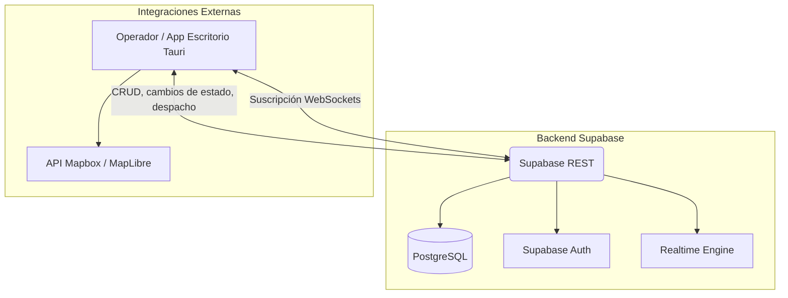

# SPEC.md: Mesa de Crisis — Sistema de Respuesta a Emergencias

> **Pivote a consola CAD de escritorio (2026-10-07).** ARGOS es ahora una única aplicación de escritorio para despachadores. El portal web ciudadano (`apps/web`) quedó archivado en `archive/web/` y fuera de los workspaces. [`ROADMAP_CAD.md`](ROADMAP_CAD.md) define el alcance, la interfaz, los contratos y las fases; si hay conflicto con este documento, manda `ROADMAP_CAD.md`.

## 1. Visión General del Sistema
Consola CAD (Computer-Aided Dispatch) de alta densidad para operadores: recibe llamadas del 123, radio VHF y sensores, gestiona incidentes, perímetros de riesgo y unidades en tiempo real, y prioriza la seguridad operativa. No existe superficie pública: toda lectura y escritura exige un operador autenticado.

## 2. Stack Tecnológico
* **Aplicación (Mesa de Crisis):** Tauri 2 + React + TypeScript. (Alta velocidad, bajo consumo de RAM, acceso a APIs nativas del OS; los secretos viven solo en el backend Rust.)
* **Estilos y UI:** Tailwind CSS 4 + design system ARGOS Táctico (`@argos/ui`).
* **Mapas y GIS:** Mapbox GL JS / MapLibre (Manejo de GeoJSON, capas vectoriales y polígonos).
* **Backend y Base de Datos:** Supabase (PostgreSQL).
  * *Realtime:* Supabase WebSockets para sincronizar incidentes, llamadas y unidades entre puestos.
  * *Auth:* email/password con rol `operador` en `app_metadata`; sin acceso anónimo.

## 3. Arquitectura (Nivel de Contenedores)

## 4. Modelo de Datos Principal (Esquema Relacional)

* **`incidentes`**: Centraliza el evento.
  * `id`, `titulo`, `nivel_criticidad` (Bajo, Medio, Crítico; pasa a prioridad P1–P4 en la Fase 2).
  * `estado` (Abierto, Contenido, Resuelto).
  * `geometria` (GeoJSON - Punto o Polígono).
  * `timeline` (JSONB con el registro de eventos, horas y autor).
* **`llamadas`** (antes `reportes_ciudadanos`): entradas registradas por el operador; ingresan como "No confirmado".
  * `id`, `tipo`, `lat`, `lng`, `imagen_url`, `estado_validacion`, más `canal` (123, VHF, SENSOR, PRESENCIAL), `prioridad`, `narrativa`, `callback`, `incidente_id` (FK) y `operador_id`.
* **`recursos_operativos`**: Gestión interna de unidades.
  * `id`, `tipo` (Bomberos, Ambulancia, Policía).
  * `estado_actual` (Disponible, Despachado, En Escena, Inoperativo; ciclo CAD con SLA en la Fase 2).
  * `incidente_asignado_id` (FK).
* **`zonas_publicas`**: refugios y bloqueos de vía (`tipo`, `capacidad_actual`, `capacidad_maxima`); ahora de uso interno del operador.
* **`zonas_riesgo`**: espejo de `incidentes` sin `timeline`, mantenido por trigger.

**Seguridad (RLS):** todas las tablas exigen `es_operador()`. El rol `anon` no tiene políticas ni acceso a tablas ni al bucket `reportes`.

## 5. Flujo Operativo Principal
1. **Ingesta:** el operador registra una llamada (123, VHF, sensor o presencial) con ubicación y narrativa. Desde la Fase 2 el sistema avisa de posibles duplicados.
2. **Contextualización:** la llamada se vincula a un incidente existente o crea uno nuevo, que entra a la cola por prioridad.
3. **Toma de Decisiones:** el operador valida el incidente, define el perímetro de riesgo (automático desde la Fase 2, con trazado manual como corrección) y despacha unidades desde el panel de detalle del incidente.
4. **Seguimiento:** Realtime sincroniza a todos los puestos; las unidades avanzan por su ciclo de vida y, desde la Fase 2, con cronómetros de SLA.

## 6. Roadmap de Desarrollo y Tareas

El desarrollo sigue **GitFlow** y *Conventional Commits*. El plan vigente (Fases 0 a 3: preparación y grilla táctica, lógica CAD, Asesor de Despacho con IA) está en [`ROADMAP_CAD.md`](ROADMAP_CAD.md). Lo entregado antes del pivote queda como base:

- [x] Monorepo, tipos compartidos, servicio Supabase aislado y modo demo.
- [x] Mapa operativo con trazado de polígonos y líneas (mapbox-gl-draw), Realtime, máquina de estados de recursos y refugios.
- [x] Login de operador, RLS validada por pruebas estáticas y design system ARGOS Táctico.
- [x] Portal ciudadano (Reporte Rápido y mapa público): **archivado** en `archive/web/`.

## 7. Reglas de Estructura de Código
- **Tipos Compartidos:** Crear un paquete/directorio `packages/shared/types` exportando las interfaces de `Incidente`, `Recurso` y `Reporte` para evitar duplicidad de contratos entre módulos de la aplicación de escritorio (y el código archivado).
- **Sincronización:** Las llamadas a Supabase deben estar aisladas estrictamente en un servicio unificado, por ejemplo `services/supabaseClient.ts`, evitando consultas directas desde los componentes de UI.

## 8. Restricciones de Alcance (Out of Scope para Fase 1)
- **NO** implementar pasarelas de pago.
- **NO** implementar autenticación con redes sociales (OAuth); ceñirse a roles internos o email/password.
- **NO** agregar gráficos 3D ni motores de mapas distintos a Mapbox GL JS / MapLibre.
- **NO** utilizar la palabra clave `any` en ningún archivo TypeScript. El tipado debe ser estricto.

## 9. Criterios de Verificación
- Cada hito del roadmap debe acompañarse de pruebas unitarias implementadas en **Vitest**.
- La tarea no se considera lista (Definition of Done) hasta que la ejecución de `npm run check` (que debe incluir linter y typecheck, ej. `npx tsc --noEmit`) retorne **0 errores**.

## 10. Sistema de Diseño Visual y Estética (Mesa de Crisis ARGOS) ### ❌ LO QUE DEBES EVITAR (Prohibiciones de "AI Slop"): 
- NO usar tipografías genéricas saturadas (Inter, Roboto, Arial, system-ui). - NO usar degradados violetas/púrpuras sobre fondo oscuro o blanco.
- NO usar tarjetas flotantes con bordes brillantes exagerados (efectos Neumorphism o deslumbrantes). 
- NO usar rejillas genéricas de 3 columnas de plantilla comercial. 
- NO usar botones redondos tipo "píldora" en interfaces tácticas operativas. 

### ✅ DIRECCIÓN VISUAL OPERATIVA (Mesa de Crisis de Alta Densidad):

- Tipo de Interfaz: Centro de mando editorial y táctico de alta densidad de información (High Information Density). 
- Tipografía: Fuera de lo común. Usa tipografías monoespaciadas tácticas para datos (JetBrains Mono, Fira Code) y tipografías limpias y de alto contraste para encabezados (Space Grotesk, Cabinet Grotesk o Lexend). 
-Paleta De colores: 
| Elemento | Modo Claro (Por Defecto) | Modo Oscuro Industrial | Rol en la Interfaz |
| :--- | :--- | :--- | :--- |
| **Fondo Base** | `#F1F5F9` (Gris Pizarra claro) | `#12161A` (Gris Carbón) | Lienzo principal (detrás del mapa y paneles). |
| **Superficies** | `#FFFFFF` (Blanco puro) | `#1A2026` (Pizarra oscuro) | Tarjetas, panel lateral, modales. |
| **Líneas (1px)** | `#E2E8F0` (Gris neutro suave) | `#2C353F` (Gris acero) | Divisiones de layout colapsable. |
| **Texto Principal** | `#0F172A` (Casi negro) | `#F8FAFC` (Blanco humo) | Títulos y lectura narrativa. |
| **Crítico (LED)** | `#E53935` (Rojo Carmesí) | `#E53935` (Rojo Carmesí) | Emergencia crítica, incidentes activos, acciones destructivas. |
| **Advertencia** | `#FFB300` (Ámbar) | `#FFB300` (Ámbar) | Riesgos secundarios, fugas, rutas bloqueadas. |
| **Activo / OK** | `#43A047` (Verde Esmeralda)| `#43A047` (Verde Esmeralda)| Recursos activos en escena, zonas seguras. |