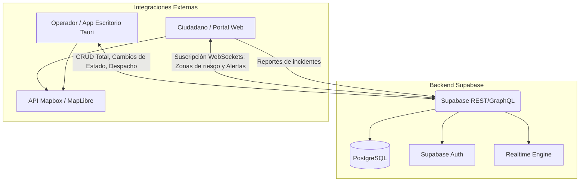

# SPEC.md: Mesa de Crisis — Sistema de Respuesta a Emergencias

## 1. Visión General del Sistema
Sistema C4I (Comando, Control, Comunicaciones, Computación e Inteligencia) compuesto por una aplicación de escritorio para operadores (Mesa de Crisis) y una aplicación web pública para ciudadanos. Orientado a la gestión de incidentes, zonas de riesgo y flujos de información en tiempo real, priorizando la seguridad operativa sin exponer coordenadas tácticas.

## 2. Stack Tecnológico
* **Frontend Escritorio (Mesa de Crisis):** Tauri + React + TypeScript. (Alta velocidad, bajo consumo de RAM, acceso a APIs nativas del OS).
* **Frontend Web (Portal Público):** React + Vite + TypeScript. Despliegue recomendado en Vercel.
* **Estilos y UI:** Tailwind CSS + Shadcn/UI (para componentes rápidos y consistentes).
* **Mapas y GIS:** Mapbox GL JS / MapLibre (Manejo de GeoJSON, capas vectoriales y polígonos).
* **Backend y Base de Datos:** Supabase (PostgreSQL).
  * *Realtime:* Supabase WebSockets para sincronización de incidentes.
  * *Auth:* Autenticación basada en roles (Operador vs. Ciudadano/Anónimo).

## 3. Arquitectura (Nivel de Contenedores)

## 4. Modelo de Datos Principal (Esquema Relacional)

* **`incidentes`**: Centraliza el evento.
  * `id`, `titulo`, `nivel_criticidad` (Bajo, Medio, Crítico).
  * `estado` (Abierto, Contenido, Resuelto).
  * `geometria` (GeoJSON - Punto o Polígono).
  * `timeline` (JSONB con el registro de eventos y horas).
* **`reportes_ciudadanos`**: Ingresan como "No confirmados".
  * `id`, `tipo` (Incendio, Bloqueo, etc.), `lat`, `lng`, `imagen_url`, `estado_validacion`.
* **`recursos_operativos`**: Gestión interna sin exposición GPS pública.
  * `id`, `tipo` (Bomberos, Ambulancia, Policía).
  * `estado_actual` (Disponible, Despachado, En Escena, Inoperativo).
  * `incidente_asignado_id` (FK).
* **`zonas_publicas`**: Lo que consume el ciudadano.
  * `id`, `tipo` (Refugio, Bloqueo de Vía).
  * `capacidad_actual`, `capacidad_maxima`.

## 5. Flujo Operativo Principal
1. **Detección:** Ciudadano envía un reporte vía Web con foto y coordenadas (o llega vía radio al operador).
2. **Contextualización:** El reporte entra a la Mesa de Crisis (Escritorio) como alerta visual.
3. **Toma de Decisiones:** El operador valida el incidente, traza un polígono de "Zona de Riesgo" en el mapa y actualiza el estado de los recursos a "Despachado".
4. **Difusión:** Automáticamente (vía WebSockets), la aplicación Web actualiza el mapa de los ciudadanos mostrando la zona de riesgo delineada y las rutas/refugios seguros sugeridos.

## 6. Roadmap de Desarrollo y Tareas

El desarrollo debe seguir una estrategia de ramificación **GitFlow** y uso de *Conventional Commits* para mantener el control de versiones organizado.

### Fase 1: Setup e Infraestructura (Sprints 1)
- [ ] Configurar proyecto Supabase (Tablas, RLS - Row Level Security para proteger datos sensibles de recursos).
- [ ] Inicializar monorepo o repositorios separados (Tauri App y Web App).
- [ ] Configurar React + Vite + TypeScript + Tailwind CSS en ambos entornos.
- [ ] Implementar autenticación básica para la Mesa de Crisis.

### Fase 2: Motor Geoespacial y Core de Escritorio (Sprints 2-3)
- [ ] Integrar Mapbox GL JS en la app de escritorio.
- [ ] Crear el panel lateral de "Mesa de Crisis" (lista de incidentes, nivel crítico, timeline).
- [ ] Desarrollar la herramienta de dibujo (Draw) para trazar polígonos de zonas de riesgo en el mapa.
- [ ] Implementar la suscripción en tiempo real a la tabla de `incidentes` y `reportes_ciudadanos`.

### Fase 3: Portal Ciudadano (Sprints 4)
- [x] Construir la interfaz pública (Mobile-first).
- [x] Integrar el mapa de solo lectura que consuma los polígonos de riesgo y refugios seguros.
- [x] Desarrollar el formulario de "Reporte Rápido" (Uso de API Geolocation del navegador).

### Fase 4: Sincronización y Refinamiento (Sprints 5)
- [ ] Desarrollar la Máquina de Estados para Recursos (Drag & Drop o botones para cambiar de "Disponible" a "Despachado").
- [ ] Validar las políticas de seguridad (RLS) en Supabase para asegurar que el portal público no pueda hacer query a la tabla de recursos operativos.
- [ ] Pruebas de carga de WebSockets simulando usuarios concurrentes recibiendo alertas.

## 7. Reglas de Estructura de Código
- **Tipos Compartidos:** Crear un paquete/directorio `packages/shared/types` exportando las interfaces de `Incidente`, `Recurso` y `Reporte` para evitar duplicidad de contratos entre la App Web y la App de Escritorio.
- **Sincronización:** Las llamadas a Supabase deben estar aisladas estrictamente en un servicio unificado, por ejemplo `services/supabaseClient.ts`, evitando consultas directas desde los componentes de UI.

## 8. Restricciones de Alcance (Out of Scope para Fase 1)
- **NO** implementar pasarelas de pago.
- **NO** implementar autenticación con redes sociales (OAuth); ceñirse a roles internos o email/password.
- **NO** agregar gráficos 3D ni motores de mapas distintos a Mapbox GL JS / MapLibre.
- **NO** utilizar la palabra clave `any` en ningún archivo TypeScript. El tipado debe ser estricto.

## 9. Criterios de Verificación
- Cada hito del roadmap debe acompañarse de pruebas unitarias implementadas en **Vitest**.
- La tarea no se considera lista (Definition of Done) hasta que la ejecución de `npm run check` (que debe incluir linter y typecheck, ej. `npx tsc --noEmit`) retorne **0 errores**.

## 10. Sistema de Diseño Visual y Estética (Mesa de Crisis ARGOS) ### ❌ LO QUE DEBES EVITAR (Prohibiciones de "AI Slop"): 
- NO usar tipografías genéricas saturadas (Inter, Roboto, Arial, system-ui). - NO usar degradados violetas/púrpuras sobre fondo oscuro o blanco.
- NO usar tarjetas flotantes con bordes brillantes exagerados (efectos Neumorphism o deslumbrantes). 
- NO usar rejillas genéricas de 3 columnas de plantilla comercial. 
- NO usar botones redondos tipo "píldora" en interfaces tácticas operativas. 

### ✅ DIRECCIÓN VISUAL OPERATIVA (Mesa de Crisis de Alta Densidad):

- Tipo de Interfaz: Centro de mando editorial y táctico de alta densidad de información (High Information Density). 
- Tipografía: Fuera de lo común. Usa tipografías monoespaciadas tácticas para datos (JetBrains Mono, Fira Code) y tipografías limpias y de alto contraste para encabezados (Space Grotesk, Cabinet Grotesk o Lexend). 
-Paleta De colores: 
| Elemento | Modo Claro (Por Defecto) | Modo Oscuro Industrial | Rol en la Interfaz |
| :--- | :--- | :--- | :--- |
| **Fondo Base** | `#F1F5F9` (Gris Pizarra claro) | `#12161A` (Gris Carbón) | Lienzo principal (detrás del mapa y paneles). |
| **Superficies** | `#FFFFFF` (Blanco puro) | `#1A2026` (Pizarra oscuro) | Tarjetas, panel lateral, modales. |
| **Líneas (1px)** | `#E2E8F0` (Gris neutro suave) | `#2C353F` (Gris acero) | Divisiones de layout colapsable. |
| **Texto Principal** | `#0F172A` (Casi negro) | `#F8FAFC` (Blanco humo) | Títulos y lectura narrativa. |
| **Crítico (LED)** | `#E53935` (Rojo Carmesí) | `#E53935` (Rojo Carmesí) | Emergencia crítica, incidentes activos, acciones destructivas. |
| **Advertencia** | `#FFB300` (Ámbar) | `#FFB300` (Ámbar) | Riesgos secundarios, fugas, rutas bloqueadas. |
| **Activo / OK** | `#43A047` (Verde Esmeralda)| `#43A047` (Verde Esmeralda)| Recursos activos en escena, zonas seguras. |